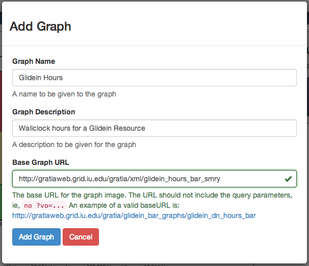
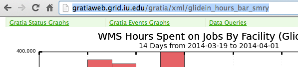

Graphs
======

Graphs are the heart of the OSG Usage App.  You can add them, remove them, and refine the graph's displayed data.

.. _addinggraphs:

Adding new Graphs
-----------------

Adding a new graph is done in the graph dropdown box in the navigation bar.

.. figure:: images/graphDropDown.png
   :align: center
   
   Graph dropdown box showing the *Add Graph* option.
   
After opening the dialog, enter the graph name and description.  Both of these attributes are arbitrary and will be used only for display purposes.

   
   Add graph dialog showing values filled in.

The **Base Graph URL** refers to the URL of the graph from `gratiaweb <http://gratiaweb.grid.iu.edu/gratia/>`_.  A list of availble graphs are availble in the gratiaweb `backpage <http://gratiaweb.grid.iu.edu/gratia/xml/>`_.  Select any of these graphs, then copy / paste the URL from the website into the **Base Graph URL**.

   
   URL copy of the graph from gratiaweb.

The App will parse the URL and determine if the graph can be retrieved.  If it is successful, it will add the graph to the profile.

.. _linkgraphs:

Get Links to Graphs
-------------------

The links are intended to be used to directly view the Gratiaweb backend pages for the graph.  The backend pages include many more parameters that can be configured than are built into the Chrome App.

.. warning::
   Not all graphs will work with the share link.  The backend page names do not always match with the image name, therefore the linked backend page is not always correct.

