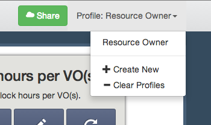

Profiles
========

A profile is a collection of graphs grouped together.  A profile may define refining parameters which are applied to each of the graphs in the profile.  

It is often useful to have mutiple profiles that can show you different information.  One profile could show usage over the last 2 weeks for the Nebraska resources.  While another profile could show the usage over the last year of the HCC VO.

.. _templateprofiles:

Template Profiles
-----------------

Three template profiles are provided when the app first starts.

OSG User
   A profile meant for users of the OSG.  Specifically, it is designed for Glidein users of the OSG, such as those using the OSG-XSEDE resource, or any of the other available glidein submission hosts.  It can be filtered by User and/or Project.
   
Resource Owner
   Meant for owners of computational resources, this profile highlights who is running on the resources and how many hours are being consumed on the filtered resources.  It can be filtered by Resource Name.
   
VO Manager
   Meant for the manager of a Virtual Organization (VO).  This profile highlights the VO's usage.  Both, who is using resources on behalf of the VO, and on what resources the VO is running.  It can be filtered by VO name.
   

.. _addingprofiles:

Adding new Profiles
-------------------

To add a new profile, click on the profile dropdown in the top right of the navigation bar.  Then, click on the *Create New* option.

   
   Dropdown box for profile creation.
   
The new profile dialog will appear, which will be the same as the first time you created a profile.

.. figure:: images/nebraskaProfile.png
   :align: center
   :height: 654
   :width: 606
   :scale: 70 %
   
   Profile showing Nebraska resources being entered.
   
Enter the appropriate information for your new profile, or enter the URL for a :ref:`shared <receivingsharedprofile>` profile.

