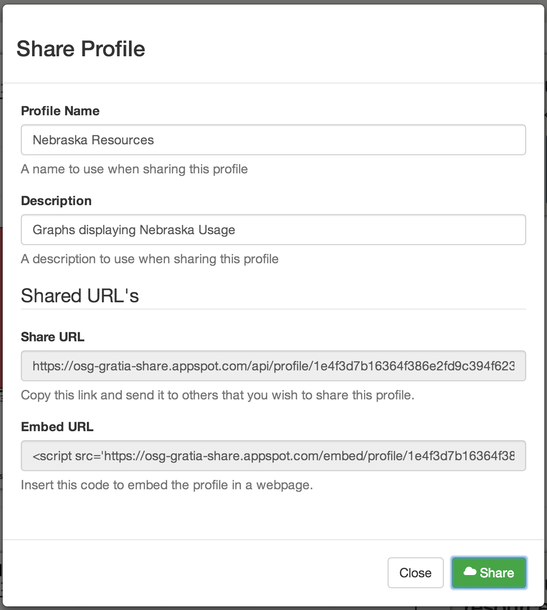
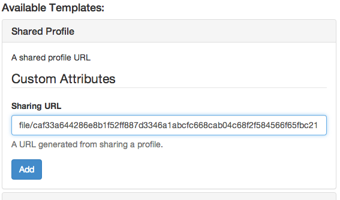

.. _sharingprofiles:

Sharing Profiles
================

The OSG Usage App provides a service to share profiles (collections of graphs) with other uses easily.

Sharing your Profile
--------------------

The OSG Usage App has the ability to generate a link that can be used by others to load the profile.  A simple web service stores the profiles when you click on the sharing link, and can be retrieved by others when creating a new profile.

After you have created a profile that you would like to share, click on the *Share* button in the top navigation bar.  It will open a dialog to fill in attributes that you would like to assign to the profile, such as *Name* and *Description*.  

   
   Sharing dialog with the sharing link selected.

Once you have entered these values, click on the share button.  It will generate a URL that you can copy into an email, or IM, and can be used by another user to load the profile.

Profiles save everything, including:

* All graphs that are in the profile.
* The refine parameters for the profile and each graph.
* Any graphs that where :ref:`added <addinggraphs>` by you.

.. note::
   The remote user will not receive updates if you change a previously shared profile.

.. _receivingsharedprofile: 

Receiving a Shared Profile
--------------------------

In order to receive a shared profile, you need to be in the :ref:`addingprofiles` dialog.  Once there, select the *Shared Profile* option, and paste the shared profile link you received into the text box.

   
   Receiving sharing profile creation.

Click the *Add* button to add the shared profile.  It may take a second to load the shared profile.

.. note::
   You will not receive updates if the original sharer updates the profile.  Further, any updates you make to the profile are local, and will not be propagated to other users.

.. _embedprofile:

Embedding a Shared Profile
--------------------------

In the sharing dialog, you will notice the embed link.  Use this link to embed a shared profile onto your own webpage.

To embed, the profile you need to:

* Create a profile in the app.
* Share the profile using the *Share* button.
* Copy the embed link from the resulting dialog.
* Paste that link into the HTML of the webpage which you wish to display the profile.

The profile, with all it's graphs and refinements, will be embedded into the webpage.

