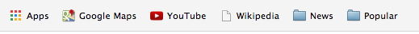

.. _tutorial-label:

OSG Chrome App Tutorial
=======================

This tutorial will step you through running the Chrome App.  The first step is installation.

Installing
----------

To install the Chrome app, download it from the `Chrome App Store <https://chrome.google.com/webstore/detail/osg-usage-viewer/nmpkkpiafdfacaadmagknacaombpkeoe>`_.  The app is free, and should install quickly.  Once it is installed, you can launch in one of two ways:

1. When opening a new tab, click the **Apps** button at the top.  This will bring you to the Chrome application list, where you can find the newly installed OSG Usage Viewer application.

2. Using the `Chrome App Launcher <https://chrome.google.com/webstore/launcher>`_, which is installed with Chrome on Mac and Windows.

Initial Setup
-------------

When you first start the App, it will show a dialog to pick a profile.  This dialog shows a list of predefined profiles for you.  Choose the one most appropriate for you.  For example, if you are an OSG user, you would choose the *OSG User* profile.  Or, if you are a *Resource Owner*, choose that profile.  

After selecting a profile, enter a small amount of information required to restrict what the graphs will show.  Below is an example for a Nebraska resource owner (administrator):

.. image:: images/nebraskaProfile.png
   :align: center
   :height: 654
   :width: 606
   :scale: 70 %

After you have entered the information, click the *Add* button.  The graphs will load and you will be displayed with the main screen.

Refining the Graphs
-------------------

Each graph can be edited by either changing the *Profile's* parameters, or each graph's individual parameters.  We will continue with the previous example of being an adminstrator at Nebraska.

Nebraska has many resources, but the graphs are only showing the usage from one of our clusters.  We wish to add our other clusters to all of the graphs.  We can change all of the graphs simultanously by selecting the *Edit Graph Properties* button from the top navigation, under *Graph*.

In this dialog, we can add more clusters into the resources box.  We add Crane and Tusker clusters.

Once you have finished, click *Refine*, or hit *Enter*.  All of the graphs in the current profile will be refreshed with the new parameters.

Sharing your Profile
--------------------

The OSG Usage App has the ability to generate a link that can be used by others to load the profile.  A simple web service stores the profiles when you click on the sharing link, and can be retrieved by others when creating a new profile.

.. note::
   The remote user will not receive updates if you change a previously shared profile.

